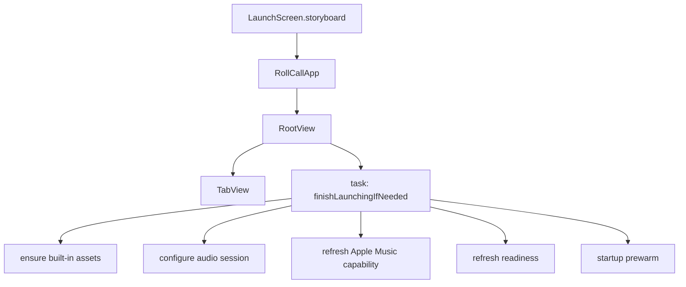
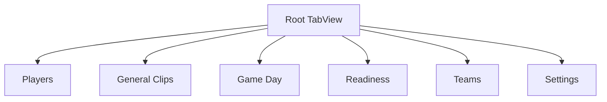
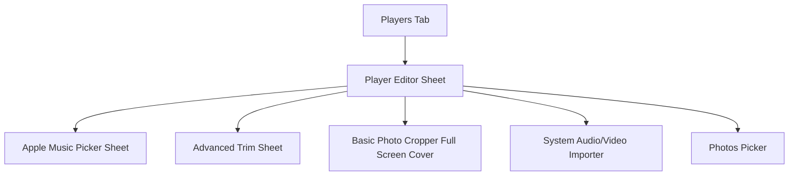
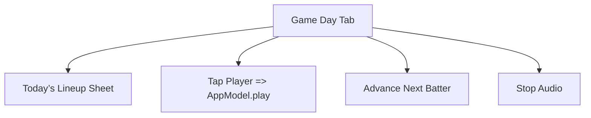
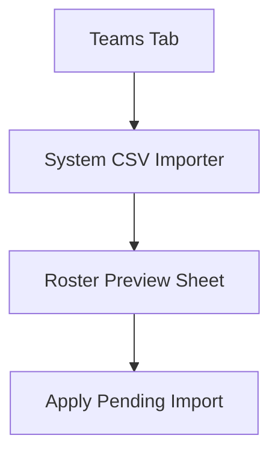
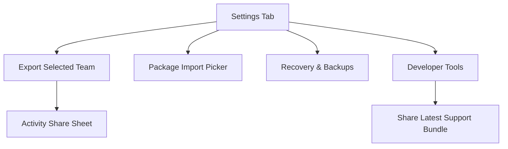

# Navigation Flow

## High-Level Summary

Navigation is mostly tab-based, with each tab wrapped in its own `NavigationStack`. Secondary workflows are primarily sheet-based. The app does not currently use deep navigation stacks, deep links, or `navigationDestination`.

Primary file:
- `RollCall/RootView.swift`

## App Launch Flow

Notes:
- The default selected tab is `Players`.
- `finishLaunchingIfNeeded()` is run from `.task` on the root view.
- Launch behavior is stateful because startup also copies built-in assets into Application Support and prepares playback/readiness state.

## Primary Tab Hierarchy

## Players Flow

Behavior notes:
- Player sheet is opened via `.sheet(item: $selectedPlayer)`.
- Song selection returns a `MusicSearchResult` and immediately mutates the player cue through `AppModel.assignAppleMusic`.
- Photo picking launches a cropper full-screen cover, with a timed fallback path if the cropper does not render.

## Game Day Flow

Behavior notes:
- `Game Day` is the main live-use surface.
- There is no deeper navigation from player cards.
- The lineup editor is presented by `.sheet(isPresented: $showLineupEditor)`.

## Teams Flow

Behavior notes:
- rename/remove actions are global alerts attached to the root shell, not isolated child screens.

## Settings Flow

## Modal and Presentation Inventory

Current explicit presentations:
- `.sheet(item:)` roster preview
- `.sheet(isPresented:)` package import picker
- `.sheet(item:)` player editor
- `.sheet(isPresented:)` lineup editor
- `.sheet(isPresented:)` package share activity view
- `.sheet(isPresented:)` Apple Music picker
- `.sheet(isPresented:)` advanced trim
- `.fullScreenCover(item:)` photo cropper
- `fileImporter` for CSV
- `fileImporter` for audio/video
- `PhotosPicker`

## State-Driven Navigation

Navigation is heavily state-driven even where the UI looks simple.

Examples:
- `selectedPlayer` controls Player Editor sheet presentation.
- `pendingRosterImport` controls Roster Preview presentation.
- `packageSharePresented` controls share sheet display.
- `showAppleMusicPicker`, `showAdvancedTrim`, and `pendingPhotoCrop` control nested edit flows inside Player Editor.
- `appModel.lastError` drives a root-level error alert.

This means future UI changes must preserve not just destinations, but also the conditions under which state becomes non-`nil` or `true`.

## Deep Links

No deep-link handling was found in the inspected source.

No evidence found for:
- custom URL scheme routing
- universal links
- scene phase routing to destinations
- `onOpenURL`

## Areas Where Navigation Feels Brittle

1. Root-level alert/sheet concentration
   - Several unrelated flows hang off `RootView`, increasing cross-interaction risk.

2. Player Editor nesting
   - Player editing launches multiple secondary flows from one sheet.
   - A redesign that changes dismissal order or sheet timing could break save/refresh behavior.

3. Global error alert
   - `appModel.lastError` is shared across flows.
   - An error thrown during one modal workflow can surface at root while another sheet is active.

4. Photo crop fallback
   - The cropper has a timer-based fallback to save the original photo if the full-screen cover fails to appear in time.
   - This is behaviorally useful, but it makes the photo flow timing-sensitive.

5. Import/export system surfaces
   - Package import, CSV import, media import, photo import, and share actions all depend on system presenters plus async callbacks.
