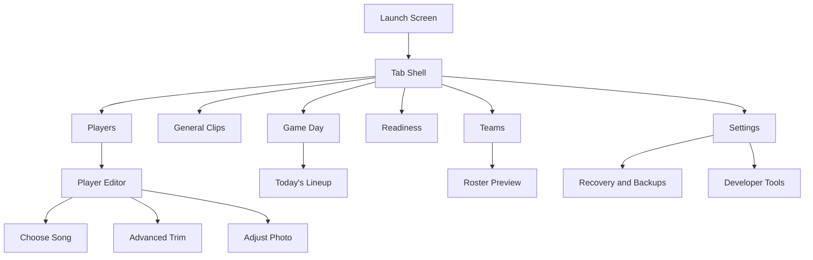
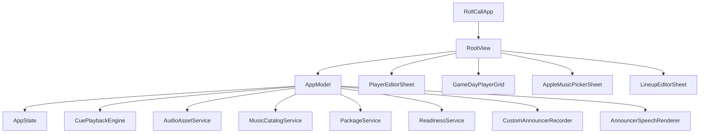

# Visual References

## Capture Status

Live screenshots were attempted but not captured in this session.

Attempted path:
- XcodeBuildMCP simulator build/run on `RollCall.xcodeproj` / scheme `RollCall`

Observed blocker:
- build failed before launch with `unable to resolve module dependency: 'ZIPFoundation'`
- tool diagnostics also reported incompatible built module target warnings for `ZIPFoundation`

Implication:
- this file documents code-derived visual structure instead of simulator screenshots

## Current Visual Sitemap

## Component Relationship Diagram

## Code-Derived Visual Notes by Surface

### Launch Screen

- dark navy full-screen background
- centered dark card
- hero image
- large `ROLL CALL` label
- smaller `GAME DAY • CUES` label

### Most Admin/Setup Screens

- grouped list/form layout
- standard iOS navigation bars
- orange tint
- system font hierarchy

### Game Day

- custom gradient background
- large rounded player cards in two-column grid
- green playback-active emphasis
- segmented control for intro mode

### Player Editor

- long grouped form
- image-first profile section
- cue-source section
- announcement cue section
- progressive disclosure for local import
- preset-first trim surface

## Suggested Future Screenshot Targets

When the build environment is healthy again, capture at minimum:
- Launch screen
- Players tab with populated roster
- Player Editor with Apple Music cue selected
- Apple Music picker with recents and search results
- Game Day with active playback
- Today’s Lineup sheet
- Readiness tab with mixed statuses
- Settings and Developer Tools
